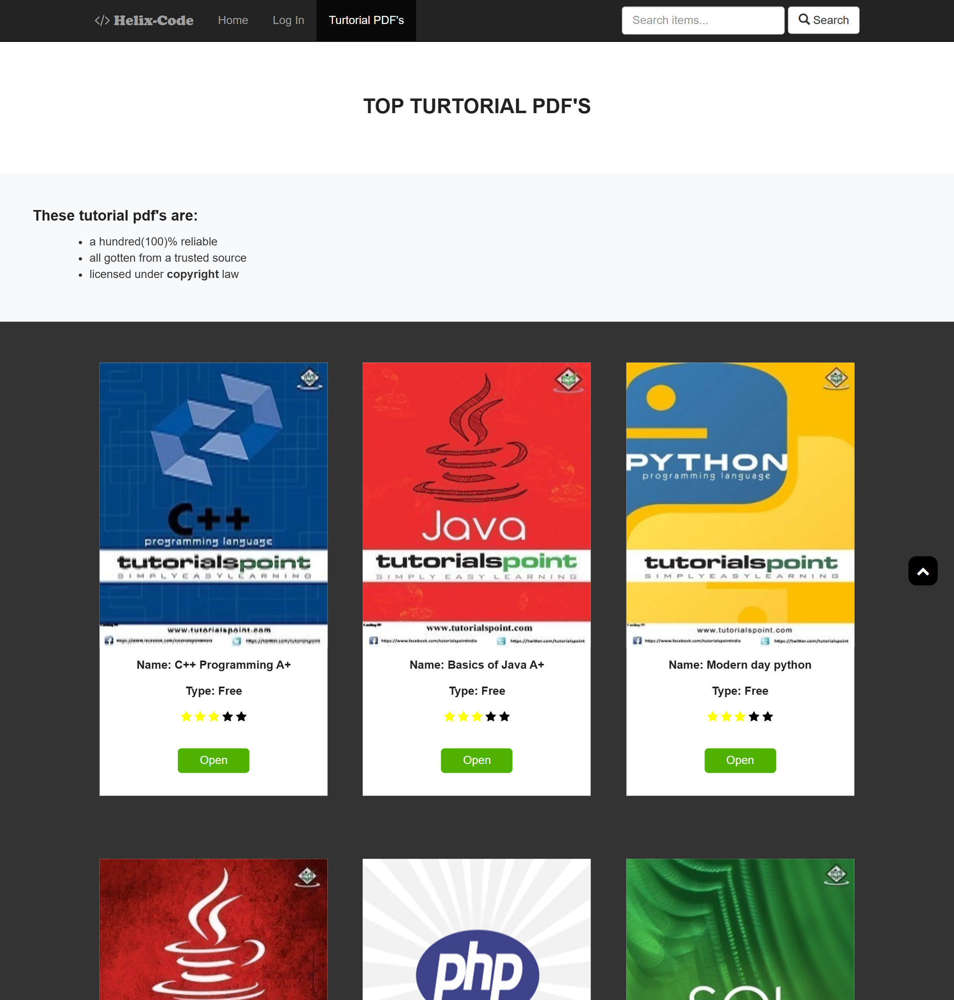
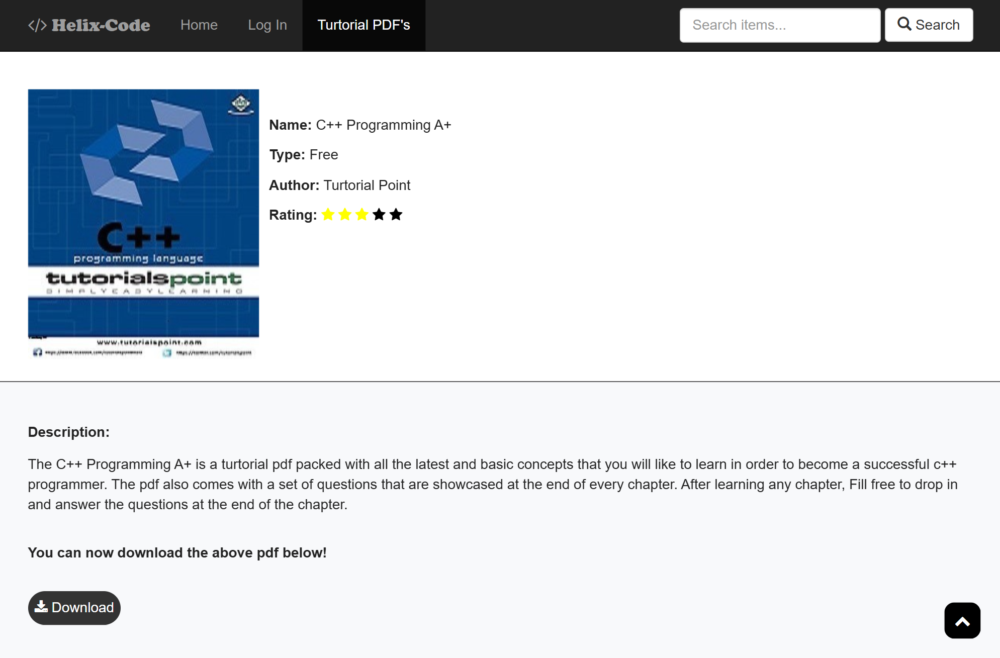

# Helix Code 

This project is an online interactive programming platform developed in 2022 during my industrial training at NIIT, Port Harcourt, Nigeria. It was built as a personal learning and practice project, not for any client or commercial use.

The purpose of the project was to improve my programming skills, apply concepts learned during training, and serve as a project for industrial training defence. It focuses on hands-on learning, experimentation, and reinforcing core web development concepts.

## How to Run
1. Clone the repository to your local machine.
2. Open the project folder in your browser and load `index.html`.

## Screenshots

### Login Page

### Home Page

### Tutorial PDFs Page

### Tutorial Page

## Tech Stack
- HTML5
- CSS3
- Bootstrap
- jQuery
- No build tools
- No frameworks

## Features
- Responsive layout
- Multi-page website structure
- Clean and simple UI design
- Bootstrap-based grid system

## Project Status
This project is no longer actively maintained. It exists as an archive of my frontend work from 2022.

## What I’d Do Differently Today
- Replace jQuery with modern JavaScript or a framework like React
- Use CSS Grid and Flexbox more extensively
- Improve accessibility (ARIA, keyboard navigation)
- Refine the user interface with better color schemes and design themes

## License
This project is for educational and demonstration purposes.